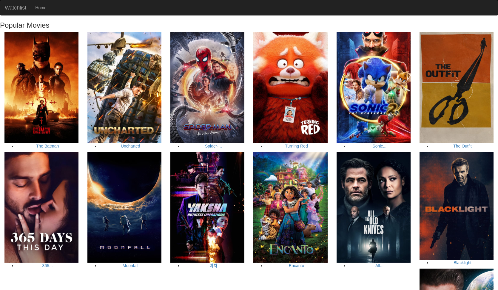

# Flask-Movie-Watchlist
A movie watchlist website made in Flask and the TMDB API



## Usage
To run the app, clone the repo to your computer using ````git clone https://github.com/Edu58/Flask-Movie-Watchlist.git````.
It the folder is zipped, unzip it and navigate into the folder. Open your terminal/cmd/shell and run ```python run.py runserver``` to start the app. After it has started, open your browser and enter ```localhost:5000``` in your url bar. It will open the apps homepage

## Technologies used
- Flask
- Flask-Bootstrap
- Flask-Script
- TMDB API